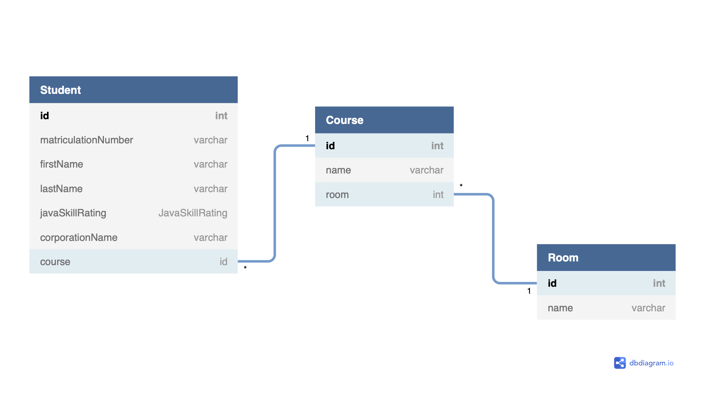

# JavaFxProject

JavaFx+Datenbank Projekt für Vorlesung Java von Sebastian Damm

**Gruppe:**
- Michel Görlach
- Daniel Taube
- David Hedtke
- Jan Baumann
- Rahil Chughtai
- Noel Cremer
- Berkan Karaman

## To-Do:
### Backend:
#### Java:
- [ ] Objekte für Räume/Studenten/Kurse/Enrollment
#### SQL/Java:
- [ ] Räume hinzufügen/löschen
- [ ] Studenten hinzufügen/löschen
- [ ] Kurse hinzufügen/löschen
- [ ] Studenten in Kursen hinzufügen/entfernen (enrollment)

### Frontend:
- [x] Landingpage
- [ ] Buttons und Dialoge für Hinzufügen/Ändern/Löschen
- [x] Scenes für verschiedene Ansichten

### DB Scheme

[Link](https://dbdiagram.io/d/60bf650fb29a09603d187c14)